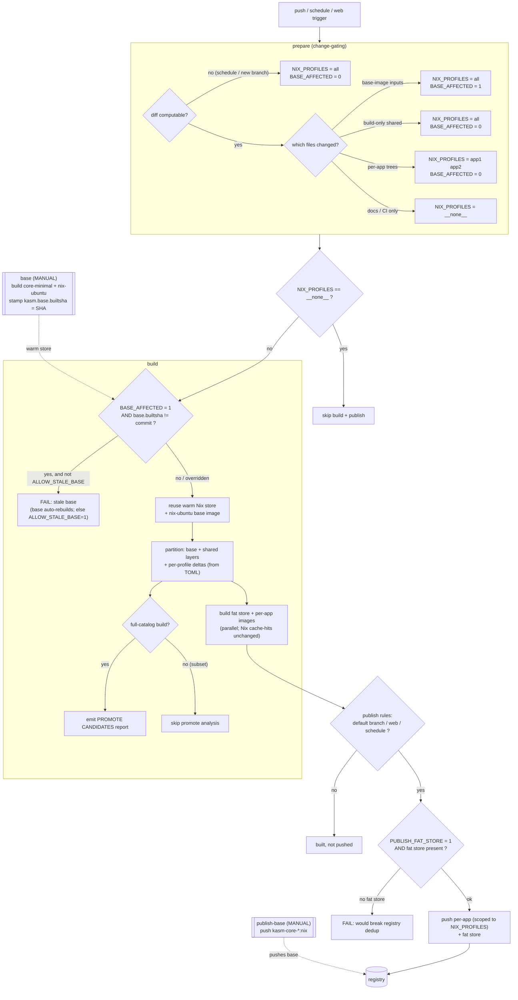

# Nix app-catalog CI/CD flow

How the `.gitlab-ci.yml` pipeline turns a git push into published `kasm-nix`
images, what it caches, and the guardrails that keep the layer-dedup model
honest. This is the operator's map — for the packaging model itself see
`design/nix-package-process.md`.

## The pipeline at a glance

```
prepare ─(base-check)─▶ base ─▶ build ─▶ publish
                                     └▶ publish-base
```

| Stage | Trigger | What it does |
|-------|---------|--------------|
| **prepare** | every run | Change-gating: diff → `NIX_PROFILES` + `NIX_BASE_AFFECTED` + `NIX_BASES_AFFECTED` (dotenv). `base-check` (same stage) unions that with upstream source-image digest staleness → `NIX_BASES_REBUILD`. |
| **base** | auto (skips when fresh) | Rebuild the stale/affected distro bases (`nix-base-build.sh`): `core` + `nix-<distro>`, **parallel across distros** (`BUILD_PARALLEL`), stamping `kasm.base.builtsha` + the source-image digest. `build` waits on it. Force with `BASE_DISTROS`. |
| **build** | auto (unless `__none__`) | `build-nix-store-volume --emit-app-images` against the warm store → fat store + per-app images. |
| **publish** | auto on default branch / web / schedule | Tag per-app images to their kasm names + push (scoped) **and** push the fat store. |
| **publish-base** | auto on default / web / schedule (scoped to rebuilt distros) | Push the rebuilt base images (`kasm-core-<distro>:nix`), keeping them in sync with what per-app images layer on. Skips when no base changed. |

Everything is automatic and gated by the commit diff (and, for bases, by the
upstream source-image digest). Base rebuilds and their publish are scoped to the
distro(s) that actually changed; force a base rebuild with the `BASE_DISTROS`
variable on a `web` pipeline.

## What's cached (nothing is "rebuilt from scratch")

The forge runner keeps a **persistent podman + Nix store** at
`/srv/nix-build/containers`. Reuse happens at two levels:

1. **Warm Nix store** — `nix profile install` for an app whose derivation is
   unchanged is a **cache hit** (near-instant); only a changed pin/derivation
   realizes new store paths.
2. **Registry blob dedup** — the base + shared layers are recomputed every build
   but **deterministically**, so their tars are byte-identical run-to-run and the
   registry skips re-uploading them by digest.

## The layer model (why the guards exist)

`build-nix-store-volume` partitions one Nix store into:

- **base layer** = closure of `[base]` in `bin/nix-profiles.toml` (pinned by
  `[nixpkgs].ref`) — app-set-independent.
- **shared layers** = `[layers.electron]`, `[layers.qt6]`, … — explicitly
  declared, app-set-independent.
- **per-app delta** = `closure(app) − (base ∪ shared layers)` — only for the
  profiles being built.

Because base + shared layers come from the **TOML, not from which apps build**, a
*subset* build (`NIX_PROFILES=steam`) emits **byte-identical** base/shared layers
to a full build — dedup holds. Shared-layer membership is **manual**: the build
prints `PROMOTE CANDIDATES` (paths in ≥ `threshold_percent` of apps that aren't
yet shared) for an operator to promote; nothing auto-promotes.

## Guardrails

Three checks keep the model from silently degrading:

1. **Base-freshness guard** (`dind-build.sh`) — now a backstop. `base` auto-rebuilds
   the affected/stale distro bases and `build` `needs: base`, so the ubuntu app base
   is normally fresh. The guard still fails the build when `NIX_BASE_AFFECTED=1` and
   the base image's `kasm.base.builtsha` ≠ the current commit (e.g. if `base` was
   skipped or its rebuild didn't cover ubuntu). Override: `ALLOW_STALE_BASE=1`.
2. **Fat-store consistency guard** (`nix-publish.sh`). Per-app images and the fat
   store share base/shared layers by digest only if pushed from the **same build**.
   With `PUBLISH_FAT_STORE=1` (default) publish refuses to push anything unless
   this build's fat store is present, so the registry never ends up with per-app
   images pointing at an older fat store's layers. Opt out: `PUBLISH_FAT_STORE=0`.
3. **Promote report** (`build-nix-store-volume`). On a full-catalog build, emits an
   actionable `PROMOTE CANDIDATES` block (skipped on subset builds, where
   prevalence is meaningless).
4. **Disk pre-flight gate + end-of-build reclaim** (`dind-build.sh`). Before the
   (large) build, enforce `DISK_MIN_GB` free on the store, escalating reclaim:
   standard GC → nuke the Nix cache → **fail** (prevents an `ENOSPC` mid-build,
   which corrupts the warm store). After the build, reclaim its transient cache so
   the downstream `scan-nix`/`publish` jobs — separate jobs on the same store —
   start with headroom. Together these are the enforcement half of the runner disk
   budget below.

## Runner requirements & disk budget

The pipeline runs on a self-hosted `nix-builder` runner (shell executor,
passwordless `sudo` for nerdctl, persistent `/srv/nix-build`). It is designed to
**live within a fixed disk budget** rather than grow unbounded. Reclaim runs at
**both ends of the build** — at the START (clears the *previous* run's finished
churn) and at the END (clears *this* build's transient cache so the downstream
jobs get headroom). The disk is sized so the guards rarely have to bite:

| Consumer | Mechanism that bounds it | Steady size |
|---|---|---|
| Warm Nix build cache (`nix-build-stage-*`) | `NIX_STAGE_CAP_G` — GC resets it if exceeded | ≤ 150 GB |
| Image working set (base + shared layers + ~45 per-app + fat store + resolute desktops, **deduped**) | per-build prune of superseded `nix-*:dev` tags + dangling layers | **~34 GB measured** |
| **Dangling build cache** (intermediate layers from `podman build`) | **start- AND end-of-build** + GC `podman builder prune -f` | ~0 (was the top offender — ~90 GB — until this was added) |
| Stale anonymous volumes (old registry staging) | start/end-of-build + GC volume prune (targeted, keeps `nix-build-stage-*`) | ~0 (≈0–35 GB between GCs) |
| Build scratch / peak (crane staging, new layers before old pruned) | transient; reclaimed each run | ~40–60 GB peak |

> **Why reclaim at the END of the build too** (added 2026-07-20): `scan-nix`
> (needs ~40 GB export scratch) and `publish` run as *separate jobs after* the
> build on the *same* store, and neither GCs. The start-of-build prune only clears
> the previous run's churn, so this build's fresh ~90 GB of `podman build` cache
> used to sit on the store through those jobs — they hit "No space left on device"
> at git-checkout. `dind-build.sh` now reclaims that cache (dangling layers +
> `builder prune -f` + stale volumes) the moment the build finishes, **keeping**
> every `localhost/nix-*:dev` image (scan/publish consume them) and the Nix cache.

> **Measured churn (forge, 2026-07-10):** a store showing 299 GB / 75 GB-free held
> only ~34 GB of real images (51 active) — the rest was ~90 GB dangling build
> cache, ~40 GB dangling image leaves, and ~75 GB reclaimable volumes. `image
> prune -f` alone missed the build cache entirely; adding `builder prune -f` is what
> closed the leak. **The runner was never too small — the GC was incomplete.**
> ⚠️ Never use `builder prune -a`/`image prune -a`: they drop the cache/images the
> tagged **base** relies on and cascade into deleting `nix-ubuntu` itself.

**Recommended dedicated runner spec** (right-sized from a measured clean full build — see below):

| Resource | Spec | Rationale |
|---|---|---|
| **Disk** (`/srv/nix-build`, SSD) | **500 GB** | Sized from the formula below: `NIX_STAGE_CAP_G (150) + DISK_MIN_GB (200) + ~60 GB base/containerd/margin ≈ 410 GB` minimum → 500 GB leaves comfortable churn + cache-growth headroom. (400 GB is the absolute floor, and only with `DISK_MIN_GB=150`.) |
| vCPU | **8** | `BUILD_PARALLEL=4` parallel Nix realizations, several compile from source. |
| RAM | **32 GB** | 4 concurrent nix builds; some apps (electron/qt/LLVM) are memory-heavy. |
| Build timeout | **4 h** | Cold full build measured ~25 min warm / ~1 h cold (cache re-seed); warm app-only rebuilds are minutes. |

> **Measured on a clean full build (2026-07-10, forge):** cold catalog build
> (`ok=35 skipped=12 failed=0`) consumed a peak of ~140 GB over the clean baseline
> (Nix cache re-seed + fat store + 35 per-app images), leaving 126–211 GB free
> throughout on the 465 GB box. Post-build store: overlay 151 GB (incl. ~70 GB of
> that run's build cache, cleared by the next build's `builder prune -f`) + volumes
> 109 GB. So even the shared 465 GB forge has ample room; **400 GB dedicated is
> generous.** The one build that failed did so because an external `sudo rm -rf` of a
> containerd task dir restarted the daemon mid-run — an argument for a *dedicated*
> (uncontended) runner, not a bigger one.

**Pipeline knobs** (`.gitlab-ci.yml` CI/CD variables). Each is a lever on the disk
budget — set them together, and size the disk from them (formula below):

```
DISK_MIN_GB      = 200   # pre-flight free-space floor (GC-then-fail if unmet)
NIX_STAGE_CAP_G  = 150   # warm Nix-cache ceiling (GC resets it above this)
BUILD_PARALLEL   = 4     # per-app build concurrency; raise only if vCPU/RAM allow
```

**What each one means:**

- **`DISK_MIN_GB`** — free space the build insists on *before it starts*. If the
  store has less, `dind-build.sh` escalates reclaim (GC → reset the Nix cache) and,
  if still short, **fails loudly** rather than ENOSPC'ing mid-build (which would
  corrupt the warm store). It is **not** the disk size — it is a *floor*, and it
  must exceed the build's mid-run growth. A cold full catalog build grows **~150 GB**
  (measured), so 200 GB gives ~35 % margin and leaves the build ending with room
  for the end-of-build reclaim to return to `scan-nix`/`publish`.
- **`NIX_STAGE_CAP_G`** — ceiling on the warm Nix build cache (`nix-build-stage-*`),
  the largest *resident* consumer. The cache only grows (old generations after
  nixpkgs bumps); above this ceiling, GC resets it (one slow re-seed). Pinning it
  makes the total predictable — keep it the same value everywhere (CI passes it
  into `nix-gc.sh`, whose standalone default of 250 the CI value overrides).
- **`BUILD_PARALLEL`** — how many per-app Nix realizations run at once. A CPU/RAM
  lever, not a disk one.

**Ops sizing rule** — provision the store as:

```
total_store  >=  NIX_STAGE_CAP_G  +  DISK_MIN_GB  +  ~60 GB   (base images + containerd + margin)
```

With the recommended `cap=150 + floor=200` → **410 GB minimum; provision 500 GB.**
The knobs and the disk move together: raising `DISK_MIN_GB` without growing the
disk just makes the pre-flight gate reset the Nix cache (slow) or fail.

> Current shared forge for reference: 465 GB total. It satisfies `DISK_MIN_GB=200`
> as long as the Nix cache stays near its 150 GB cap (resident ≈ cache + base +
> containerd ≈ 190 GB → ~275 GB free ≥ 200 floor). It's the working *dev* box, not
> the production target — a **dedicated 500 GB runner** removes the contention that
> caused the one historical mid-run failure (an external `sudo rm -rf` restarted
> containerd). If the working set ever legitimately can't fit the budget, the gate
> **fails loudly** rather than silently corrupting the store — the signal to grow
> the disk or trim the catalog.

## Change-gating outcomes

`ci-scripts/nix-changed-profiles.sh` maps the commit diff to two signals:

| Changed files | `NIX_PROFILES` | `NIX_BASE_AFFECTED` |
|---|---|---|
| base-image inputs (`dockerfile-nix-ubuntu`, `dockerfile-kasm-core-minimal`, `src/common/*`, `nix/scripts/*`, `nix/units/*`) | `""` (all) | `1` |
| build-only shared (`build-nix-store-volume`, `nix-crane-assemble`, `nix-profiles.toml`, `dockerfile-nix-app-finish`, `runs/nix-portal/*`) | `""` (all) | `0` |
| per-app trees (`src/ubuntu/install/nix/<app>/…`) | `"app1 app2"` | `0` |
| docs / CI only | `"__none__"` | `0` |
| schedule / new branch / no diff base | `""` (all) | `0` |

A manual/trigger `NIX_PROFILES` variable overrides the computed value.

## Build-run report

Every `publish` run emits a structured report as a **90-day job artifact** —
`nix-build-report.json` (machine-readable) and `nix-build-report.md` (rendered
in the MR/pipeline view). It answers *"what changed and what got updated"* by
comparing **this build's `dev.kasm.nix.store-path` label** (on the freshly built
local image) against the **currently-published image's** same label, read from
the registry with `skopeo` (no layer pull). Those labels are stamped onto every
image by `nix-crane-assemble` (see `design/nix-package-process.md` §Provenance).

### Status classification

| `status` | meaning |
|---|---|
| `new` | no such image published yet (also every image on the first run after labels land) |
| `updated` | store-path differs → content changed; clients re-pull that image's delta |
| `unchanged` | identical store-path → dedup no-op; no client re-pull |
| `skipped` | outside `NIX_PROFILES` scope this run (not built/pushed) |
| `failed` | tag/push failed |

The `nix-store` row classifies the **fat store on its `base-rev`** (not a
store-path): `updated` there means the base nixpkgs commit moved — a
world-rebuild where every layer re-emits and all clients re-pull the base.

**Push policy (`action` column).** `status` is the content comparison; `action`
is what publish actually did:
- `new` / `updated` per-app image → **pushed**.
- `unchanged` per-app image → **skipped** (identical store-path already
  published; re-pushing would only churn the manifest + provenance labels since
  every layer dedups). A consequence: an unchanged image's `revision` / built-at
  labels stay at the build that last actually changed it — usually what you want.
- The **fat store always pushes** (`action=pushed`) even when its `base-rev` is
  `unchanged`: it carries every app's store partition, so its content changes
  whenever *any* app does, and skipping it would reopen the registry dedup gap
  (`PUBLISH_FAT_STORE=1`; see `design/nix-dedup-gap.md`).

### Schema — `nix-build-report.json`

```jsonc
{
  "run": {
    "gitSha":       "abc123…",            // CI_COMMIT_SHA of this pipeline
    "baseRef":      "github:NixOS/nixpkgs/nixos-25.05",  // floating input ref
    "baseRev":      "d40795…",            // concrete commit it resolved to (pin/repro token)
    "scope":        "chrome vscode",      // NIX_PROFILES ("" = whole catalog)
    "baseAffected": "0",                  // NIX_BASE_AFFECTED (1 = base inputs changed)
    "metrics": {                          // from dind-build.sh (build stage)
      "startedAt": "2026-07-11T10:00:00Z",
      "endedAt":   "2026-07-11T10:42:00Z",
      "durationSec": 2520,
      "diskFreeBeforeG": 300,
      "diskFreeAfterG":  250,
      "diskConsumedG":   50,              // before − after; NEGATIVE if a GC ran mid-build
      "profiles": "chrome vscode"
    }
  },
  "images": [
    {
      "profile":        "chrome",         // nix-profiles.toml profile key
      "kasmName":       "chrome",         // published name (kasm_name override or profile)
      "dest":           "…/chrome:nix",   // full pushed ref
      "status":         "updated",        // see table above
      "action":         "pushed",         // pushed | skipped | failed
      "rev":            "aaaa1111",       // nixpkgs commit THIS app built against
      "version":        "128.0.1",        // best-effort app version (may be "")
      "storePath":      "/nix/store/NEW-…-profile",   // this build's closure identity
      "prevStorePath":  "/nix/store/OLD-…-profile",   // published image's ("" if none)
      "changedPackages": "chromium: 127.0 -> 128.0; +libwebp 1.4"  // null unless changed
    }
    // … one object per per-app image, plus the "nix-store" fat-store row
  ],
  "summary": { "updated": 1, "unchanged": 2, "skipped": 1 }  // counts by status
}
```

`changedPackages` is a flattened `nix store diff-closures` (previous build →
this build) — the exact package version/size deltas.

### Example — `nix-build-report.md`

```md
# Nix build report

- commit: `abc123`
- scope: `chrome vscode`  · base-affected: `0`
- build: 2520s · disk consumed 50 G

| Image        | Status    | Version | Action  |
|--------------|-----------|---------|---------|
| `chrome`     | updated   | 128.0.1 | pushed  |
| `vs-code`    | unchanged | 1.90    | pushed  |
| `nix-store`  | unchanged | base999 | pushed  |

## Changed closures (vs previous build)
### chrome
    chromium: 127.0 -> 128.0
    +libwebp 1.4
```

### How it's populated

The report is assembled in the **publish** stage but fed by sidecars the
**build** stage leaves in the persistent output dir (`$DIND_ROOT/output`, which
survives between jobs because both run on the one `nix-builder` runner):

| Sidecar | Written by | Tooling | Contents |
|---|---|---|---|
| `labels.json` | `build-nix-store-volume` (inner) | jq (in the nix container) | base ref/rev + per-app ref/rev/store-path/version |
| `closure-diffs.{json,tsv}` | `build-nix-store-volume` (inner) | jq + `nix store diff-closures` | per-app diff vs the **previous build on this box** (`labels.prev.json` is rotated each run) |
| `metrics.json`, `podman-df-{before,after}.txt` | `dind-build.sh` | `printf` / `df` / `podman system df` | duration + disk before/after |
| `publish-results.tsv` | `nix-publish.sh` | `podman`/`skopeo` label reads (Go templates) | per-image registry classification + push action |

`nix-publish.sh` then merges all of the above → `nix-build-report.{json,md}`.
The `.md` path is **`jq`-free** (values scraped with `sed`/`awk`); the `.json`
path uses `jq`, which `nix-publish.sh` installs best-effort if the publish image
lacks it. The publish job finally `sudo cp`s both files from the root-owned
output dir into `$CI_PROJECT_DIR` so GitLab captures them as artifacts.

### Caveats

- **First run after this lands:** published images predate the labels, so every
  image reports `new` (nothing to diff against). Correct from the second run on.
- **Two different "changed" signals.** The per-image `status` is **registry
  truth** ("did the published image's content change"). `changedPackages` is
  **box history** ("what changed vs the last build on this runner") and is
  best-effort: if the previous build's closure was GC'd from the warm store, the
  detail reads `prev closure not in store — diff skipped` while `status` still
  shows `changed`. They can differ (e.g. publish was skipped, or the box was
  wiped) — trust `status` for release decisions.
- **`skopeo` dependency.** Prev-label reads use `skopeo` (present in
  `quay.io/podman/stable`). If absent, prev-lookup returns empty → items
  classify `new` that run (functional, but `unchanged` can't be detected).
- **`diskConsumedG` can be negative** when a mid-build GC reclaims more than the
  build consumed — that's a net reclaim, not an error.
- **Same-runner assumption.** The build→publish sidecar handoff relies on both
  jobs sharing `$DIND_ROOT/output`. Re-running *only* `publish` reuses the last
  build's sidecars (stale metrics/diffs) but still does a **live** registry
  classification.

Reproducibility ties in via the labels: `run.baseRev` + each image's `rev` are
the exact nixpkgs commits built against — set `[nixpkgs].ref` (or a profile's
`ref`) to a recorded rev to reproduce or roll back (see
`design/nix-package-process.md` §Provenance).

## Control flow



## Operator playbook

- **Changed an app's wiring** (`src/ubuntu/install/nix/<app>/`) → just push; only
  that app rebuilds + publishes.
- **Bumped a nixpkgs pin** (`bin/nix-profiles.toml`) → whole catalog rebuilds on
  the existing base (no base rebuild needed); publish pushes all.
- **Changed a base-image input** (`src/common/*`, `src/<distro>/*`, the base
  dockerfiles, nix scripts/units) → `base-check` flags the affected distro(s),
  `base` auto-rebuilds them, `build` waits, and `publish-base` publishes them —
  no manual step. (The freshness guard remains as a backstop; `ALLOW_STALE_BASE=1`
  overrides it if ever needed.)
- **Upstream source image moved** (`ubuntu:24.04` / `fedora:42` / `alpine:3.21`) →
  on a publishing pipeline (schedule/web/default) `base-check`'s digest compare
  flags it stale → same auto rebuild + publish path.
- **Docs / CI-only change** → `build`/`publish` no-op (`__none__`).
- **GC** → a scheduled pipeline with `NIX_GC=1` runs only the `gc` job.
