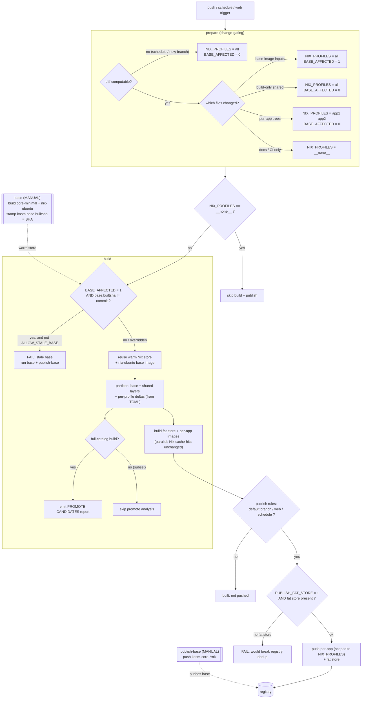

# Nix app-catalog CI/CD flow

How the `.gitlab-ci.yml` pipeline turns a git push into published `kasm-nix`
images, what it caches, and the guardrails that keep the layer-dedup model
honest. This is the operator's map — for the packaging model itself see
`design/nix-package-process.md`.

## The pipeline at a glance

```
prepare ─▶ (base, base-fedora, base-alpine)* ─▶ build ─▶ publish
                                              └▶ publish-base*
              * = manual jobs
```

| Stage | Trigger | What it does |
|-------|---------|--------------|
| **prepare** | every run | Change-gating: diff the commit → `NIX_PROFILES` + `NIX_BASE_AFFECTED` (dotenv). |
| **base** / base-fedora / base-alpine | **manual** | Build `core-minimal` + `nix-<distro>` into the persistent store; stamp `kasm.base.builtsha`. |
| **build** | auto (unless `__none__`) | `build-nix-store-volume --emit-app-images` against the warm store → fat store + per-app images. |
| **publish** | auto on default branch / web / schedule | Tag per-app images to their kasm names + push (scoped) **and** push the fat store. |
| **publish-base** | **manual** | Push the base images (`kasm-core-<distro>:nix`). |

Two things are **deliberately manual**: rebuilding the OS/base image and
publishing it. Everything else is automatic and gated by the commit diff.

## What's cached (nothing is "rebuilt from scratch")

The forge runner keeps a **persistent podman + Nix store** at
`/srv/nix-build/containers`. Reuse happens at two levels:

1. **Warm Nix store** — `nix profile install` for an app whose derivation is
   unchanged is a **cache hit** (near-instant); only a changed pin/derivation
   realizes new store paths.
2. **Registry blob dedup** — the base + shared layers are recomputed every build
   but **deterministically**, so their tars are byte-identical run-to-run and the
   registry skips re-uploading them by digest.

## The layer model (why the guards exist)

`build-nix-store-volume` partitions one Nix store into:

- **base layer** = closure of `[base]` in `bin/nix-profiles.toml` (pinned by
  `[nixpkgs].ref`) — app-set-independent.
- **shared layers** = `[layers.electron]`, `[layers.qt6]`, … — explicitly
  declared, app-set-independent.
- **per-app delta** = `closure(app) − (base ∪ shared layers)` — only for the
  profiles being built.

Because base + shared layers come from the **TOML, not from which apps build**, a
*subset* build (`NIX_PROFILES=steam`) emits **byte-identical** base/shared layers
to a full build — dedup holds. Shared-layer membership is **manual**: the build
prints `PROMOTE CANDIDATES` (paths in ≥ `threshold_percent` of apps that aren't
yet shared) for an operator to promote; nothing auto-promotes.

## Guardrails

Three checks keep the model from silently degrading:

1. **Base-freshness guard** (`dind-build.sh`). `base`/`publish-base` are manual and
   `build` doesn't depend on them, so a base-affecting change could rebuild the
   whole catalog on a **stale base**. The guard fails the build when
   `NIX_BASE_AFFECTED=1` and the base image's `kasm.base.builtsha` ≠ the current
   commit. Override: `ALLOW_STALE_BASE=1`.
2. **Fat-store consistency guard** (`nix-publish.sh`). Per-app images and the fat
   store share base/shared layers by digest only if pushed from the **same build**.
   With `PUBLISH_FAT_STORE=1` (default) publish refuses to push anything unless
   this build's fat store is present, so the registry never ends up with per-app
   images pointing at an older fat store's layers. Opt out: `PUBLISH_FAT_STORE=0`.
3. **Promote report** (`build-nix-store-volume`). On a full-catalog build, emits an
   actionable `PROMOTE CANDIDATES` block (skipped on subset builds, where
   prevalence is meaningless).

## Change-gating outcomes

`ci-scripts/nix-changed-profiles.sh` maps the commit diff to two signals:

| Changed files | `NIX_PROFILES` | `NIX_BASE_AFFECTED` |
|---|---|---|
| base-image inputs (`dockerfile-nix-ubuntu`, `dockerfile-kasm-core-minimal`, `src/common/*`, `nix/scripts/*`, `nix/units/*`) | `""` (all) | `1` |
| build-only shared (`build-nix-store-volume`, `nix-crane-assemble`, `nix-profiles.toml`, `dockerfile-nix-app-finish`, `runs/nix-portal/*`) | `""` (all) | `0` |
| per-app trees (`src/ubuntu/install/nix/<app>/…`) | `"app1 app2"` | `0` |
| docs / CI only | `"__none__"` | `0` |
| schedule / new branch / no diff base | `""` (all) | `0` |

A manual/trigger `NIX_PROFILES` variable overrides the computed value.

## Control flow



## Operator playbook

- **Changed an app's wiring** (`src/ubuntu/install/nix/<app>/`) → just push; only
  that app rebuilds + publishes.
- **Bumped a nixpkgs pin** (`bin/nix-profiles.toml`) → whole catalog rebuilds on
  the existing base (no base rebuild needed); publish pushes all.
- **Changed a base-image input** (`src/common/*`, `dockerfile-nix-ubuntu`, nix
  scripts/units) → run **`base`** then **`publish-base`** for this commit, *then*
  let `build`/`publish` run. Skipping the base rebuild now **fails fast** with
  instructions (or set `ALLOW_STALE_BASE=1` to knowingly proceed).
- **Docs / CI-only change** → `build`/`publish` no-op (`__none__`).
- **GC** → a scheduled pipeline with `NIX_GC=1` runs only the `gc` job.
